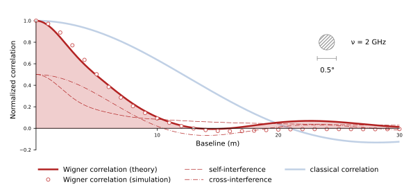

# Wigner interferometry

Proof-of-principle simulations for the "Wigner interferometry" paper.



---

> **Wigner interferometry**
>
> Vladimir Lenok
>
> <https://arxiv.org/abs/xxxx>
>
> **Abstract:**
> 
> *Aims.* This work aims to introduce a new method of interferometric measurements based on correlation of Wigner functions constructed for the fields from a distant source.
> 
> *Methods.* This work presents theoretical studies of correlation of the Wigner functions. Numerical simulations support the findings.
> 
> *Results.* It is shown that in comparison to the correlation of the fields, a correlation of their Wigner functions samples twice higher spatial frequencies of the source intensity distribution and has about twice smaller scale of the spatial pattern. This opens a fundamental possibility to improve the angular resolution of interferometric measurements by a factor of two.

---

## Repository contents

The notebooks reproduce the numerical simulations, analytical correlation functions, and figures used by the paper:

- `compute-rect.ipynb` computes the results for a rectangular source.
- `compute-circ.ipynb` computes the results for a circular source.
- `plot-paper.ipynb` generates Figure 3 of the paper.
- `plot-frontfig.ipynb` generates the image shown at the top of this README.
- `sigproc.py` provides the filter and Wigner-transform functions used by the compute notebooks.

## Prerequisites

- [`uv`](https://docs.astral.sh/uv/getting-started/installation/)
- A working LaTeX and `dvipng` toolchain containing `amsmath`, `amssymb`, and the Latin Modern fonts (required only by `plot-paper.ipynb`)

The repository pins Python 3.10.15 in `.python-version`. If it is not already installed, `uv` downloads it automatically.

## Setup

Clone the repository, enter its directory, and create the locked environment:

```bash
git clone https://github.com/vlenok/wigner-interferometry.git
cd wigner-interferometry
uv sync --locked
```

Then start JupyterLab in that environment:

```bash
uv run jupyter lab
```

## Reproducing the results

Run every cell in the notebooks in this order:

1. `compute-rect.ipynb`
2. `compute-circ.ipynb`
3. `plot-paper.ipynb`
4. `plot-frontfig.ipynb`

The first two notebooks are the computationally intensive part of the workflow. They use fixed random seeds and write their numerical results to `data/`. The plotting notebooks read those files and create:

- `figures/comb-fig.pdf` from `plot-paper.ipynb`
- `figures/front-fig.svg` and `figures/front-fig.pdf` from `plot-frontfig.ipynb`

All notebooks assume that Jupyter was started from the repository root. Running a plotting notebook before both compute notebooks finish will fail because the required files in `data/` do not exist yet.

For reference, a verification run on Linux with an AMD EPYC 7402P took 16 minutes 31 seconds for `compute-rect.ipynb` and 11 minutes 49 seconds for `compute-circ.ipynb`. Each notebook used one CPU core and peaked at approximately 18 GB of RAM. Actual resource use and runtime will vary by machine.

### Non-interactive execution

The entire workflow can also be run sequentially from the terminal. Executed copies of the notebooks are written to `executed-notebooks/`, leaving the source notebooks unchanged:

```bash
mkdir -p executed-notebooks
(
    set -e
    for notebook in \
        compute-rect.ipynb \
        compute-circ.ipynb \
        plot-paper.ipynb \
        plot-frontfig.ipynb
    do
        uv run jupyter nbconvert \
            --to notebook \
            --execute \
            --ExecutePreprocessor.timeout=-1 \
            --output-dir executed-notebooks \
            "$notebook"
    done
)
```

## Alternative setup without `uv`

The same project can be installed with standard Python tooling:

```bash
python3.10 -m venv .venv
source .venv/bin/activate
python -m pip install --upgrade pip
python -m pip install .
jupyter lab
```

This installs compatible dependency versions, but does not use the exact versions recorded in `uv.lock`.

## Citation

For citations, please use the following:

```bibtex
@ARTICLE{xxx,
    author = {Lenok, Vladimir},
    title  = {Wigner interferometry},
}
```
